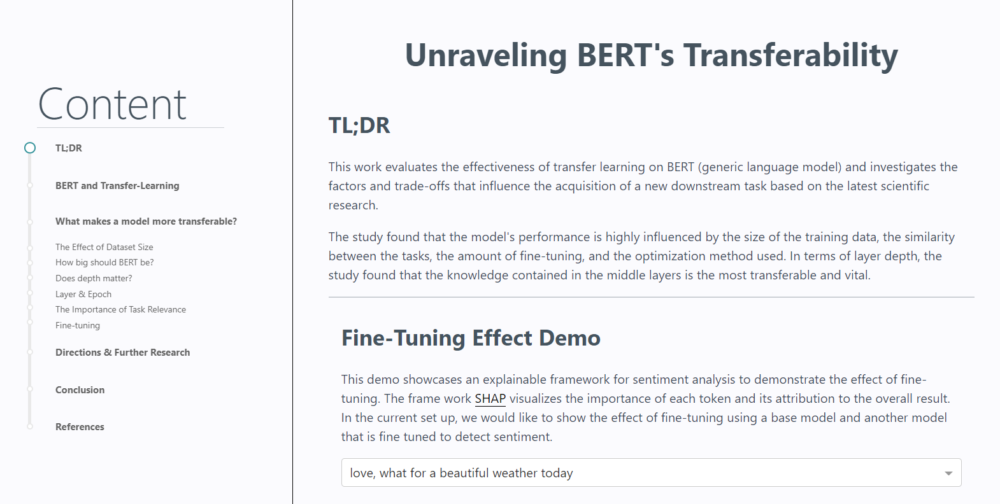
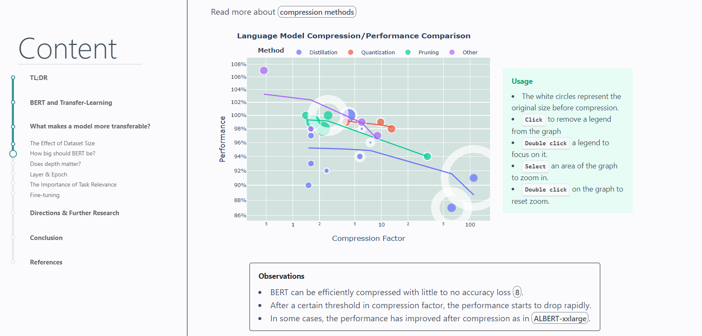

# Unraveling BERT's Transferability secrets in a Dash article

This is a demo of the Dash interactive Python framework developed by [Plotly](https://plot.ly/).

Dash abstracts away all of the technologies and protocols required to build an interactive web-based application and is a simple and effective way to bind a user interface around your Python code.

To learn more check out our [documentation](https://plot.ly/dash).

## Getting Started

### Running the app locally

First, clone the git repo, then create a virtual environment for installing dependencies.
Feel free to use conda or any other environment manager of your choice.

```

git clone https://github.com/amrohendawi/unraveling-bert-article
cd unraveling-bert-article
python -m venv venv


```

Activate the environment and install the requirements with pip

```
source venv/bin/activate
pip install -r requirements.txt

```

Run the app

```

python app.py

```

## About the app

This Dash app adapts the excellent [NY Times report A 3-D View of a Chart That Predicts The Economic Future: The Yield Curve](https://www.nytimes.com/interactive/2015/03/19/upshot/3d-yield-curve-economic-growth.html) as a base project.

## Built With

- [Dash](https://dash.plot.ly/) - Main server and interactive components
- [Plotly Python](https://plot.ly/python/) - Used to create the interactive plots

## Heroku DevOps

You can push the project to production by simply creating a new app on heroku and connecting it to your github repo within 60 seconds.


## Screenshots

The following are screenshots for the app in this repo:




<!-- 
 -->